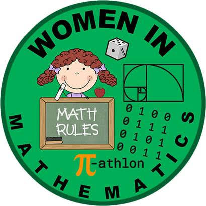

"We are in the era of big data, and big data needs statisticians to make sense of it. The democratization of data means that those who can analyze it well will win. Data is the sword of the twenty-first century, those who wield it well, the samurai." --- Eric Schmidt & Jonathan Rosenberg, in their book *How Google Works*

**Scholarly and Pedagogical Interests**

* statistics identity
* statistics education
* data science education
* standards-based grading
* electronic student engagement
* history of statistics / data science
* women and minorities in statistics
* mathematics / statistics in popular culture
* [Women in Mathematics Patch for Girl Scouts](https://cs.appstate.edu/sjg/awm/earnedbadge.html)

My co-authors and I are pleased to announce that our paper **“Raising the Bar with Standards-Based Grading”** has been chosen as the [PRIMUS Editors' Picks 2024, Most Downloaded Paper](https://primusmath.com/2025/01/03/editors-picks-2024/). Please refer to the PRIMUS link or my [Scholarship](https://jillthomley.github.io/scholarship.html) page for more information.

*This site was last rendered on `r format(Sys.time(), "%A, %B %d, %Y at %I:%M %p.")`*

