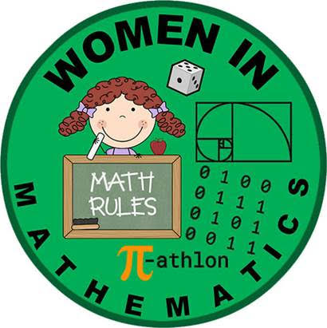

"It is critical that statisticians—or anyone who uses data—be more than just data crunchers. They should be data problem solvers who interrogate the data and utilize questioning throughout the statistical problem-solving process to make decisions with confidence, understanding that the art of communication with data is essential." --- *Pre-K–12 Guidelines for Assessment and Instruction in Statistics Education II (GAISE II)*

**Scholarly and Pedagogical Interests**

* statistics identity
* statistics education
* data science education
* standards-based grading
* electronic student engagement
* history of statistics / data science
* women and minorities in statistics
* mathematics / statistics in popular culture
* [Women in Mathematics Patch for Girl Scouts](https://cs.appstate.edu/sjg/awm/earnedbadge.html)

*This site was last rendered on `r format(Sys.time(), "%A, %B %d, %Y at %I:%M %p.")`*

